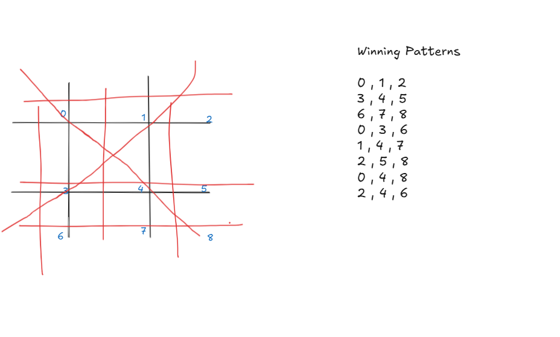

I rebuilded my first game, a project to gain hands-on experience 
Name :  🎮 Tic Tac Toe game

## What I built
 Player turns ( X and O)
 Win and Draw Detection
 Reset and Restart button
 Used Html, Css and Javascript

 ## What I learned mainly in Js
 DOM manipulation by document.querySelector
 -- It is used to get the element that matches CSS selector.

 .innerText
 -- It is used to read the text inside elements

 .addEventListner
 -- It is used to deteck user clicks.

 ## I learned Js fundamentals
 Used conditionals like if/else to check :
 --If a player ( X or O) has won
 -- If the game was a Draw

 ## I also learned about game logic, winning patterns
 
  

 # Credits
 Inspired by Apna College
